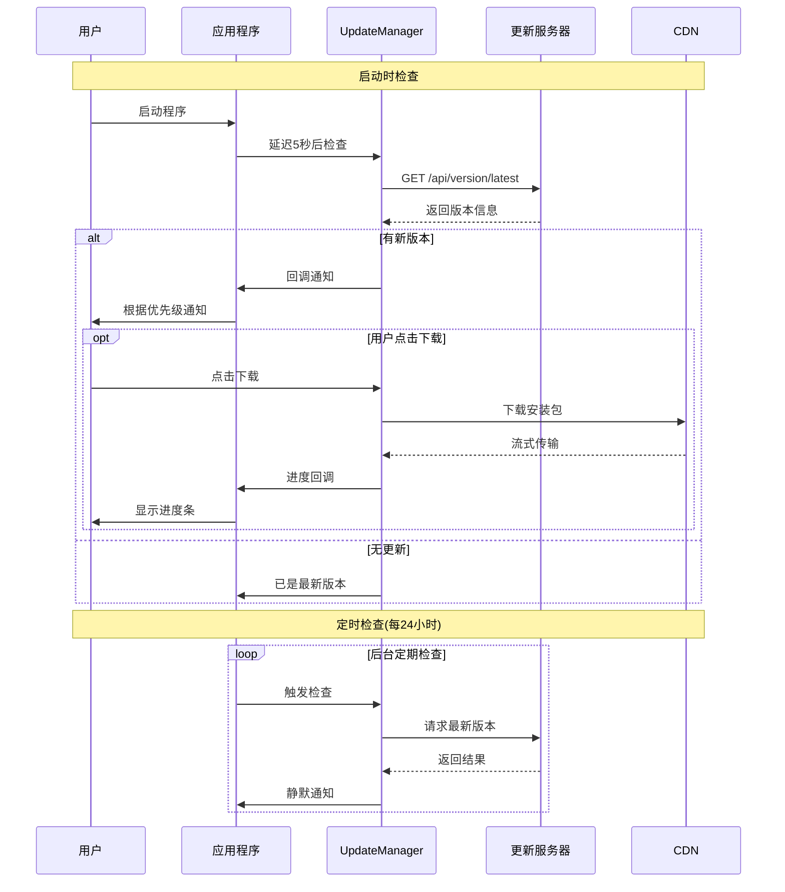

# 自动更新系统使用指南

## 📋 目录
- [功能概述](#功能概述)
- [用户如何使用](#用户如何使用)
- [开发者如何发布更新](#开发者如何发布更新)
- [推送策略配置](#推送策略配置)
- [技术实现](#技术实现)

---

## 功能概述

本系统提供**三种更新推送方式**,确保用户能及时收到版本更新通知:

### ✅ 已实现的功能

1. **启动时检查** - 程序启动5秒后自动后台检查
2. **定时后台检查** - 每24小时自动检查一次(可配置)
3. **手动检查** - 点击"🔄 检查更新"按钮立即检查
4. **智能通知** - 根据更新优先级采用不同通知方式
5. **一键下载** - 内置下载器,支持断点续传

---

## 用户如何使用

### 方式1: 自动接收通知(推荐)

```
程序启动 → 自动检查 → 发现新版本 → 日志区提示
                              ↓
                    根据优先级决定通知方式:
                    - 紧急: 立即弹窗 + 桌面通知
                    - 重要: 日志提示
                    - 常规: 静默记录
```

### 方式2: 主动检查更新

```
点击左侧面板的 "🔄 检查更新" 按钮
    ↓
弹出更新对话框
    ↓
查看更新内容
    ↓
点击"立即下载"按钮
    ↓
等待下载完成
    ↓
运行安装程序
```

### 方式3: 后台自动检查

```
程序运行期间
    ↓
每24小时自动检查一次
    ↓
发现新版本 → 日志提示
```

---

## 开发者如何发布更新

### 步骤1: 准备更新包

```bash
# 1. 打包新版本
python build_exe.py

# 2. 编译安装器(使用Inno Setup)
# 编译 installer_setup.iss

# 3. 上传到CDN
# 例如: https://cdn.videogen.com/releases/v1.1.0.exe
```

### 步骤2: 调用API发布版本

```python
import requests

# 发布新版本
response = requests.post(
    "https://api.videogen.com/api/version/publish",
    json={
        "version": "1.1.0",
        "release_date": "2026-05-10",
        "download_url": "https://cdn.videogen.com/releases/v1.1.0.exe",
        "file_size": 52428800,  # 50MB
        "changelog": [
            "🎉 新增13种艺术风格",
            "✅ 优化图片生成速度",
            "🐛 修复音频导入bug",
            "💡 改进用户体验"
        ],
        "force_update": False,  # 是否强制更新
        "priority": "normal"    # 优先级: low/normal/high/critical
    }
)

print(response.json())
# {"message": "版本 v1.1.0 发布成功", "version": "1.1.0"}
```

### 步骤3: 验证发布

```python
# 检查版本信息
response = requests.get(
    "https://api.videogen.com/api/version/latest",
    params={"current_version": "1.0.0"}
)

print(response.json())
```

---

## 推送策略配置

### 优先级说明

| 优先级 | 值 | 通知方式 | 使用场景 |
|--------|-----|---------|----------|
| **紧急** | `critical` | 立即弹窗 + 桌面通知 | 安全漏洞、严重bug |
| **重要** | `high` | 日志提示 + 可选弹窗 | 重要新功能、性能提升 |
| **常规** | `normal` | 仅日志提示 | 常规功能更新 |
| **轻微** | `low` | 静默记录 | 小修复、文档更新 |

### 配置示例

#### 示例1: 紧急安全更新

```json
{
  "version": "1.0.1",
  "force_update": true,
  "priority": "critical",
  "changelog": [
    "🚨 修复严重安全漏洞",
    "⚠️ 请立即更新以保障数据安全"
  ]
}
```

**效果**: 
- ✅ 启动时立即弹窗
- ✅ 显示桌面通知
- ✅ 标记为"强制更新"

---

#### 示例2: 重要功能更新

```json
{
  "version": "1.1.0",
  "force_update": false,
  "priority": "high",
  "changelog": [
    "🎉 新增云端AI服务支持",
    "✨ 支持Stable Diffusion XL",
    "🚀 生成速度提升50%"
  ]
}
```

**效果**:
- ✅ 日志区醒目提示
- ⚠️ 可选择是否弹窗

---

#### 示例3: 常规更新

```json
{
  "version": "1.0.2",
  "force_update": false,
  "priority": "normal",
  "changelog": [
    "✅ 优化界面布局",
    "🐛 修复已知问题"
  ]
}
```

**效果**:
- ✅ 日志区简单提示
- ❌ 不弹窗打扰用户

---

### 定时检查间隔配置

在代码中修改检查频率:

```python
# ui_init.py 中
self.start_periodic_update_check(interval_hours=24)  # 默认24小时

# 可调整为:
# interval_hours=12   # 每12小时
# interval_hours=6    # 每6小时
# interval_hours=1    # 每小时(不推荐)
```

---

## 技术实现

### 架构设计

```
┌─────────────┐         ┌──────────────┐         ┌─────────────┐
│  客户端      │         │  更新服务器   │         │  CDN存储    │
│             │         │              │         │             │
│ • 启动检查   │◄────────│ • 版本API    │◄────────│ • 安装包    │
│ • 定时检查   │ HTTP    │ • 发布接口   │ 部署    │ • 元数据    │
│ • 手动检查   │         │ • 历史记录   │         │             │
│ • 下载器     │         │              │         │             │
└─────────────┘         └──────────────┘         └─────────────┘
```

### 核心组件

#### 1. UpdateManager (客户端)
- 位置: `video_generator/auto_updater.py`
- 功能: 版本检查、下载管理
- 特点: 单例模式、异步执行

#### 2. Version Server (服务端)
- 位置: `backend/version_server.py`
- 功能: 版本查询、发布管理
- 接口:
  - `GET /api/version/latest` - 获取最新版本
  - `POST /api/version/publish` - 发布新版本
  - `GET /api/version/history` - 版本历史

#### 3. UI集成
- 位置: `video_generator/mixins/ui_panels.py`
- 功能: 
  - `check_for_updates()` - 手动检查
  - `start_periodic_update_check()` - 定时检查
  - `show_windows_notification()` - 桌面通知

### 工作流程



---

## 常见问题

### Q1: 如何禁用自动更新检查?

**A**: 注释掉`ui_init.py`中的相关代码:

```python
# 禁用启动检查
# threading.Thread(target=check_updates_on_startup, daemon=True).start()

# 禁用定时检查
# self.start_periodic_update_check(interval_hours=24)
```

---

### Q2: 如何自定义检查频率?

**A**: 修改`interval_hours`参数:

```python
# 每12小时检查一次
self.start_periodic_update_check(interval_hours=12)

# 每6小时检查一次
self.start_periodic_update_check(interval_hours=6)
```

---

### Q3: 如何实现强制更新?

**A**: 发布时设置`force_update=true`:

```python
requests.post(url, json={
    "version": "1.1.0",
    "force_update": True,  # 强制更新
    "priority": "critical"  # 最高优先级
})
```

客户端会自动弹窗并标记为"必须安装"。

---

### Q4: 桌面通知不显示怎么办?

**A**: Windows桌面通知需要`winrt`库:

```bash
pip install winrt
```

如果未安装,会自动降级为tkinter弹窗。

---

### Q5: 如何测试更新功能?

**A**: 本地测试步骤:

1. 修改`auto_updater.py`中的`UPDATE_API_URL`为本地地址
2. 启动`version_server.py`
3. 发布测试版本
4. 运行主程序验证

---

## 最佳实践

### ✅ 推荐做法

1. **分级推送** - 根据重要性选择优先级
2. **渐进式** - 先log_only,再popup,最后forced
3. **用户友好** - 避免频繁打扰用户
4. **容错处理** - 网络失败不影响主程序
5. **日志记录** - 所有操作都有日志追踪

### ❌ 避免做法

1. **频繁检查** - 不要每小时检查(消耗资源)
2. **强制弹窗** - 非紧急情况不要强制更新
3. **阻塞UI** - 检查必须异步执行
4. **忽略错误** - 要有完善的错误处理
5. **硬编码URL** - 使用配置文件管理

---

## 未来扩展

### 计划中的功能

- [ ] 增量更新(只下载变更部分)
- [ ] 更新回滚机制
- [ ] A/B测试不同推送策略
- [ ] 用户反馈收集
- [ ] 更新统计分析

---

## 技术支持

如遇到问题,请检查:

1. 网络连接是否正常
2. 更新服务器是否可达
3. 版本号格式是否正确(语义化版本)
4. API响应格式是否符合规范

---

**最后更新**: 2026-05-03  
**版本**: v1.0.0
